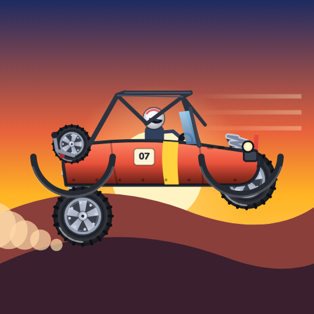

# 🏁 RUSH TRACK

**Turbo-charged 2D hill-racing stunt adventure.** Drive farther than you ever have, chain flips for coin bonuses, upgrade your rig in the garage and unlock four hand-crafted worlds.



## ▶️ Play

Open `index.html` in any modern browser (or run the dev server below). Built mobile-first for landscape touch play; desktop uses **WASD / Arrow keys**.

| Action | Touch | Keyboard |
|---|---|---|
| Gas / rotate backwards in air (backflip) | Hold right pedal | → / D / W |
| Brake / reverse / rotate forwards in air (frontflip) | Hold left pedal | ← / A / S |
| Pause | ⏸ button | — |

**How to score:** distance pays coins, airborne flips pay big (double & triple multipliers), clean landings matter, fuel cans keep you alive. Your best distance is marked in-world with a pennant flag, and every 250 m is celebrated.

## 🗺️ Content

- **4 stages** — Sunny Meadows, Dust Canyon (unlock 800 m), Neon Harbor (1 800 m), Frostbite Pass (3 200 m) — each with its own terrain character, sky, parallax layers, props, weather and ambience. Ice patches in Frostbite genuinely cut your grip.
- **3 vehicles** — Scout Buggy, Dune Mauler (monster truck), Vortex GT (rally prototype) — each with distinct physics, art and engine sound.
- **Garage** — 5 upgrade tracks per vehicle (Engine, Suspension, Tires, Fuel Tank, AWD), 5 levels each, with live stat preview.
- **Persistence** — coins, unlocks, upgrades, records & settings via `localStorage`.

## 🛠️ Built with

Zero dependencies, zero asset files* — **every pixel and every sound is generated in code** at runtime:

- **Rendering** — HTML5 Canvas, layered painters: gradient skies, procedural parallax ridges & skylines, fbm terrain with strata/dressing, hand-authored vector vehicles (sprung coil suspension, rotating spoked wheels, driver with reactive head, damage overlays, detachable wheel on crash), particles (dust, smoke, sparks, debris, snow, pollen), speed streaks, vignette, screen shake.
- **Physics** — custom rigid-body + penalty-spring wheel simulation at 240 Hz substeps, friction-circle drive, air control, wheelie governor, head-impact crash detection, flip/air-time stunt tracking.
- **Audio** — 100 % procedural WebAudio: two sequenced music tracks (menu chill + driving synthwave) with drums/bass/arps/pads, RPM-driven engine synth with gear illusion per vehicle, biome ambience beds (birds, hawks, crickets & distant sirens, arctic gusts), and 20+ SFX.
- **UI** — DOM/CSS design system (chunky buttons, pills, panels, pip bars) + custom SVG icon set; nothing uses emoji or text-as-icons.

\* plus two webfonts (Titan One, Nunito, bundled as `woff2`) and PWA icons rendered from the game's own painters.

## 🧪 QA pipeline (`tools/`)

The repo ships a headless visual + physics QA harness (see `tools/qa.mjs`, `tools/analyze.mjs`):

```bash
cd tools && npm install
node serve.js &        # serve the game on :8080
node qa.mjs --shots    # screenshot every screen & stage
node qa.mjs --soak     # autopilot 90 s × 4 seeds × 4 biomes
node analyze.mjs       # numeric art QA: palettes, sprite bounds, wheel coverage
node make-icons.mjs    # regenerate PWA icons from in-game art
```

`analyze.mjs` asserts per-biome composition (sky hue, ground hue, luminance), vehicle sprite geometry (bounds in meters, wheel pixel coverage), and that all 20 prop painters emit art — so regressions fail loudly.

## 📦 Android packaging

The game is a static web app; wrap it with [Capacitor](https://capacitorjs.com):

```bash
npm i -D @capacitor/cli @capacitor/core @capacitor/android
npx cap init "Rush Track" com.rushtrack.game --web-dir=.
npx cap add android && npx cap open android
```

Recommended `config.ts`: `android: { allowMixedContent: false }`, landscape orientation lock (already set in `manifest.webmanifest`), fullscreen. No network calls are made at runtime, so it also packages fully offline.

## 📁 Layout

```
index.html            shell (canvas + DOM UI root + rotate hint)
style.css             UI design system
src/                  ES modules: main, physics, world, render, props,
                      vehicleArt, particles, audio, ui, input, save, data, util
assets/fonts          bundled woff2 (Titan One / Nunito)
assets/img            PWA icons (rendered from in-game painters)
tools/                dev server + QA harness (its node_modules is git-ignored)
```
